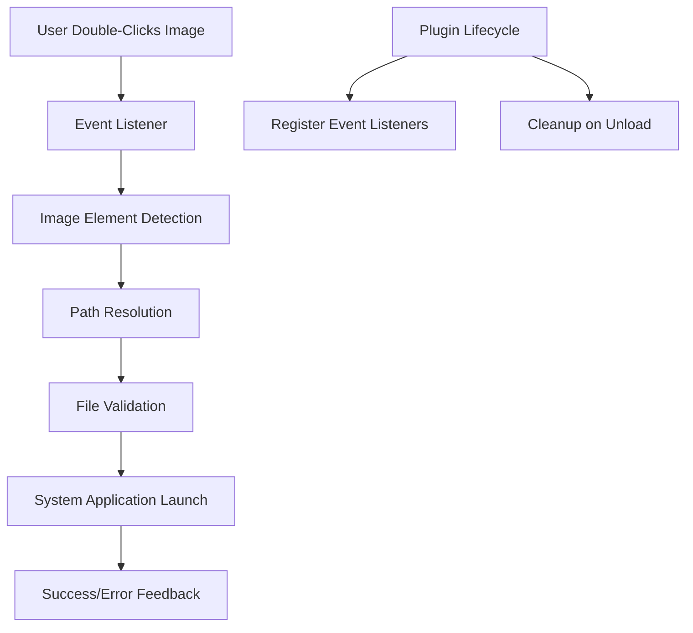

# Design Document

## Overview

The Double-Click Image Opener plugin is a lightweight Obsidian plugin that enhances image interaction by enabling users to open images in their default system application through double-click events. The plugin leverages Obsidian's Plugin API to register DOM event listeners and uses Node.js child_process to launch external applications.

The design follows Obsidian's plugin architecture patterns and ensures minimal performance impact while providing robust error handling and cross-platform compatibility.

## Architecture

### High-Level Architecture



### Core Components

1. **Event Management System**: Handles DOM event registration and cleanup
2. **Image Detection Module**: Identifies and validates image elements
3. **Path Resolution Service**: Converts relative paths to absolute file paths
4. **System Integration Layer**: Interfaces with the operating system to launch applications
5. **Error Handling System**: Provides user feedback for various error conditions

## Components and Interfaces

### Main Plugin Class

```typescript
export default class DoubleClickImageOpenerPlugin extends Plugin {
  private eventHandler: ImageEventHandler;
  
  async onload(): Promise<void>
  onunload(): void
}
```

### Image Event Handler

```typescript
class ImageEventHandler {
  constructor(private app: App, private plugin: Plugin)
  
  public registerEventListeners(): void
  public unregisterEventListeners(): void
  private handleImageDoubleClick(event: MouseEvent): Promise<void>
  private isImageElement(element: HTMLElement): boolean
  private extractImagePath(element: HTMLImageElement): string | null
}
```

### Path Resolution Service

```typescript
class PathResolver {
  constructor(private app: App)
  
  public resolveImagePath(imagePath: string): string | null
  private isAbsolutePath(path: string): boolean
  private resolveRelativePath(path: string): string
  private validateFileExists(path: string): boolean
}
```

### System Launcher

```typescript
class SystemLauncher {
  public static async openWithDefaultApp(filePath: string): Promise<void>
  private static getOpenCommand(): string
  private static executeCommand(command: string, args: string[]): Promise<void>
}
```

### Error Handler

```typescript
class ErrorHandler {
  public static handleFileNotFound(imagePath: string): void
  public static handlePermissionError(error: Error): void
  public static handleSystemError(error: Error): void
}
```

## Data Models

### Image Context

```typescript
interface ImageContext {
  element: HTMLImageElement;
  originalPath: string;
  resolvedPath: string | null;
  fileExists: boolean;
}
```

### Plugin Configuration

```typescript
interface PluginSettings {
  showSuccessNotifications: boolean;
  enableDebugLogging: boolean;
}
```

## Error Handling

### Error Categories

1. **File Not Found**: Image path cannot be resolved or file doesn't exist
2. **Permission Errors**: System denies access to file or default application
3. **System Errors**: Operating system fails to launch the application
4. **Path Resolution Errors**: Unable to convert relative paths to absolute paths

### Error Handling Strategy

- **Graceful Degradation**: Plugin continues to function even if some images fail to open
- **User Feedback**: Clear, actionable error messages via Obsidian's Notice system
- **Logging**: Debug information for troubleshooting (when enabled)
- **Fallback Behavior**: No interference with normal Obsidian image functionality

### Error Messages

```typescript
const ERROR_MESSAGES = {
  FILE_NOT_FOUND: "Image file not found: {path}",
  PERMISSION_DENIED: "Permission denied when trying to open image",
  SYSTEM_ERROR: "Failed to open image with default application",
  PATH_RESOLUTION_FAILED: "Could not resolve image path"
};
```

## Testing Strategy

### Unit Testing

1. **Path Resolution Tests**
   - Test relative path conversion
   - Test absolute path handling
   - Test edge cases (special characters, spaces)
   - Test non-existent file handling

2. **Image Detection Tests**
   - Test various image element types
   - Test different markdown image syntax
   - Test embedded vs linked images

3. **System Integration Tests**
   - Mock system calls for different platforms
   - Test error handling for system failures

### Integration Testing

1. **Event Handling Tests**
   - Test double-click event registration
   - Test event cleanup on plugin unload
   - Test event propagation and interference

2. **Cross-Platform Tests**
   - Test Windows (`start` command)
   - Test macOS (`open` command)
   - Test Linux (`xdg-open` command)

### Manual Testing Scenarios

1. **Basic Functionality**
   - Double-click images in different view modes
   - Test various image formats (PNG, JPG, GIF, WebP)
   - Test images in different folder structures

2. **Edge Cases**
   - Images with special characters in names
   - Non-existent images
   - Images without default applications
   - Very large images

3. **Performance Testing**
   - Test with documents containing many images
   - Verify no performance degradation during normal use

## Implementation Considerations

### Cross-Platform Compatibility

- **Windows**: Use `start` command with proper argument escaping
- **macOS**: Use `open` command with file path
- **Linux**: Use `xdg-open` command with fallback options

### Performance Optimization

- **Event Delegation**: Use single event listener on document with event delegation
- **Lazy Loading**: Only resolve paths when actually needed
- **Debouncing**: Prevent rapid successive double-clicks

### Security Considerations

- **Path Validation**: Ensure paths stay within vault boundaries
- **Command Injection Prevention**: Properly escape file paths for system commands
- **File Type Validation**: Only process actual image files

### Obsidian API Integration

- **Plugin Lifecycle**: Proper registration and cleanup of event listeners
- **Vault API**: Use Obsidian's vault methods for file operations
- **Notice System**: Leverage Obsidian's notification system for user feedback
- **Settings Integration**: Optional settings tab for user preferences