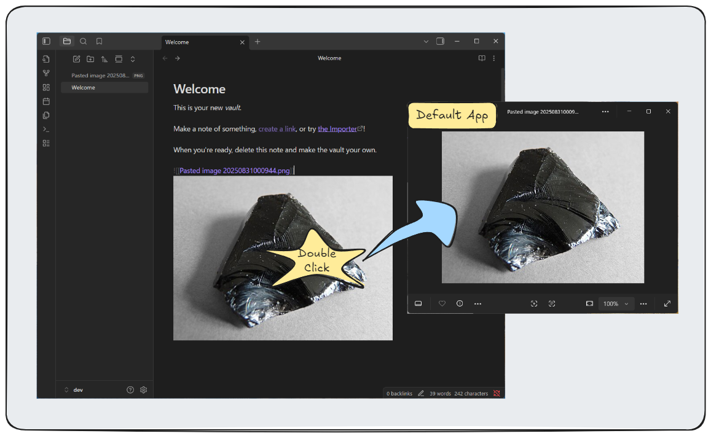

# Double-Click Image Opener

A lightweight Obsidian plugin that allows you to open images in your default system application by double-clicking them.



## Features

- Double-click any image to open it in your default system image viewer
- Works across all view modes (Reading, Live Preview, Source)
- Supports all common image formats (PNG, JPG, GIF, WebP, SVG, etc.)
- Cross-platform support (Windows, macOS, Linux)

## How to Use

1. Install and enable the plugin in Obsidian settings
2. Double-click any image in your vault
3. The image opens in your default system image viewer

## Installation

### From Obsidian Community Plugins

1. Open Obsidian Settings
2. Go to Community Plugins
3. Search for "Double-Click Image Opener"
4. Install and enable the plugin

### Manual Installation

1. [Download the latest release](https://github.com/atman-33/double-click-image-opener/releases)
2. Extract files to `.obsidian/plugins/double-click-image-opener/`
    ```
    /.obsidian/plugins/double-click-image-opener/
      +
      +- main.js
      +- manifest.json
      +- styles.css
    ```
3. Enable the plugin in settings

## Settings

- **Show success notifications**: Display notification when image opens (optional)

Access via: Settings → Community Plugins → Double-Click Image Opener

## Troubleshooting

**Images don't open?**
- Check that the plugin is enabled
- Verify the image file exists
- Ensure you have a default image viewer set

**Permission errors?**
- Check file permissions
- Try opening the image manually first

## License

MIT License - see [LICENSE](LICENSE) file for details.
